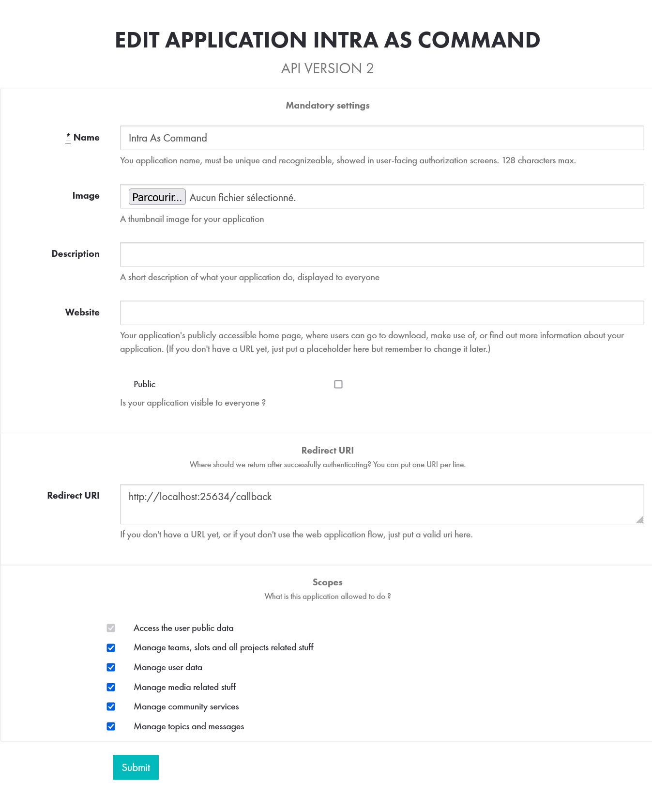

# ftcli
###### also known 42cli

Easily interact with the intra in your terminal!

## Installation

```bash
mkdir ~/ftcli/
cd ~/ftcli/
wget https://github.com/restray/42cmd/releases/latest/download/ftcli_linux64 -O ftcli
```

At this point, you NEED to have an 42 API application key. Go on this: https://profile.intra.42.fr/oauth/applications.

Configure your application like this:



Follow this rules:
 - The URL should always be `http://localhost:25634/callback`
 - Name your application with a name that you can identify AS YOURS.
 - Check **all** the scopes. (Otherwise you'll get errors/permissions denied)

Then, create a file called `.env` in the `~/ftcli/` folder.
Add [this content](./.env.example) to the file and fill it with your informations `uid` and `secret` (on the intra).

If you want to use the program everywhere:

### For bash users (default)

```bash
echo "PATH=$PATH:$HOME/ftcli/" >> ~/.bashrc
```

### For zsh users

```zsh
echo "PATH=$PATH:$HOME/ftcli/" >> ~/.zshrc
```

```bash
vim ~/.bashrc
```

## ToDo List

 - Add Lynx Browser with option (-l) to allow users to connect with terminal only